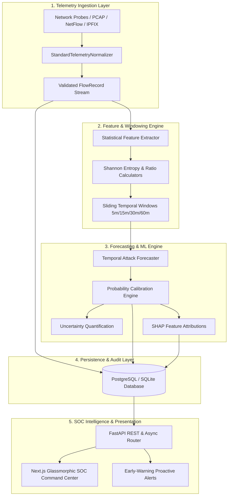
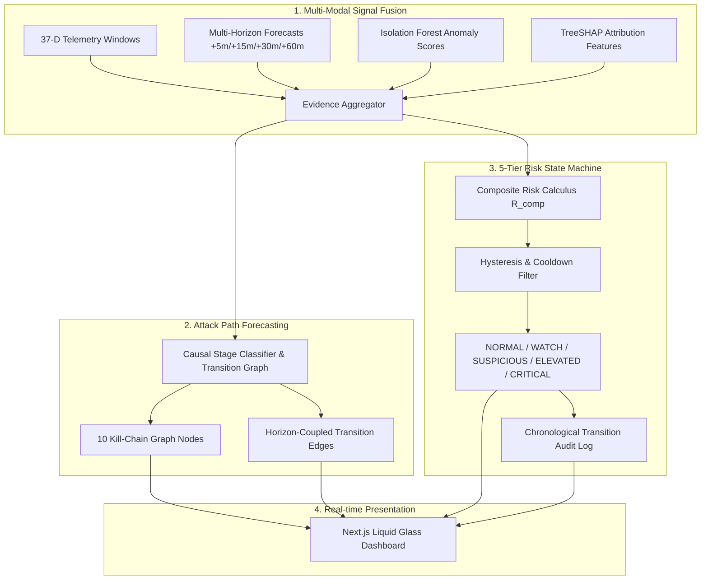

# Foresight AI — System Architecture Document

## 1. Executive Summary
**Foresight AI** is a defensive cybersecurity platform developed for the Smart India Hackathon 2026 under the problem statement:
> *"AI-based Network Attack Forecasting from Network Traffic Data"*

While traditional Intrusion Detection Systems (IDS) operate reactively (asking *"What is happening now?"*), Foresight AI operates predictively (asking *"What attack is likely to materialize next?"*).

---

## 2. High-Level Architectural Pipeline

---

## 3. Core Architectural Layers

1. **Telemetry Ingestion Layer (`backend/app/ml/pipeline.py`, `backend/app/api/v1/endpoints/telemetry.py`)**:
   - Ingests raw multi-source flow telemetry and normalizes it into strongly typed `FlowRecord` models.
   - Validates timestamps, IP formats, port bounds, protocols, and calculates flow rates.

2. **Feature Engineering & Windowing Engine (`backend/app/ml/pipeline.py`)**:
   - Aggregates flows over sliding time windows (5 to 60 minutes).
   - Computes statistical flow metrics, port entropy, source IP entropy, and TCP flag anomaly ratios.

3. **Machine Learning & Forecasting Contracts (`backend/app/ml/contracts.py`, `backend/app/ml/base.py`)**:
   - Implements multi-horizon forecasting (`5m`, `15m`, `30m`, `60m`).
   - Quantifies epistemic and aleatoric uncertainty via credible intervals.
   - Computes per-feature attribution matrices.

4. **Security & Data Layer (`backend/app/db/`, `backend/app/core/security.py`)**:
   - Multi-tenant relational schema using SQLAlchemy 2.0.
   - JWT HS256 authentication with Bcrypt password hashing.
   - Cryptographic secrets configured strictly via environment variables.

5. **SOC Presentation Layer (`frontend/`)**:
   - High-density dark cybersecurity interface built with Next.js and Tailwind CSS.
   - Apple Liquid Glass design tokens for visual clarity and real-time posture awareness.

---

## 4. Current Status vs Future Roadmap

- **Currently Implemented (Step 1)**: Core architecture, data contracts, ORM models, API routes, security and logging middleware, test suites, Next.js frontend skeleton, and container definitions.
- **Planned in Future Steps (Steps 2–12)**: Dataset curation, live PCAP parser, real model training (gradient boosted temporal classifiers), online streaming window workers, SHAP explainability visualizations, automated mitigation playbooks.

---

## 5. Step 7: Attack Path Forecasting & 5-Tier Risk State Engine

