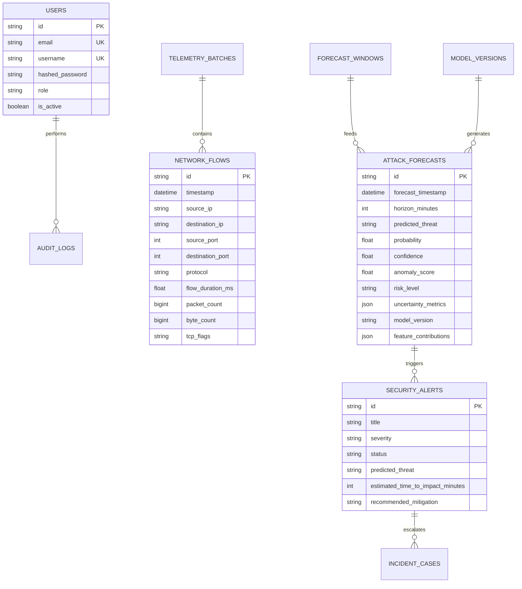

# Foresight AI — Database Architecture & Entity Specifications

## 1. Relational Schema Design

---

## 2. Table Indexing & Query Optimizations
- `network_flows`: Composite index on `(timestamp, source_ip, destination_ip)` and `(destination_port, protocol)` for temporal sliding window slicing.
- `attack_forecasts`: Index on `(forecast_timestamp, predicted_threat)` and `(risk_level, horizon_minutes)` for real-time SOC alerting.
- `audit_logs`: Index on `(action, created_at)` for compliance tracking.
