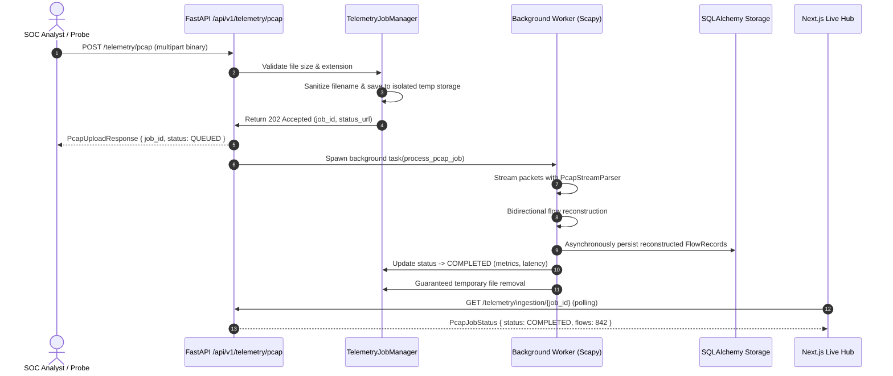

# Foresight AI — PCAP Processing Engine & Security Controls

## 1. Asynchronous PCAP Ingestion Architecture



---

## 2. Defensive Security Controls for PCAP Processing

1. **Path Traversal Defense**:
   - Client-provided filenames are completely stripped of directory paths, relative path tokens (`..`), slashes, and control characters:
     ```python
     safe_name = "".join(c for c in base if c.isalnum() or c in (".", "-", "_"))
     ```
   - Server-side files are stored exclusively with cryptographically unique UUIDs in an isolated temporary staging directory (`foresight_pcap_staging`).

2. **File Size & Memory Limits**:
   - Maximum upload payload size enforced: **50 MB**.
   - Streaming packet iterator (`PcapReader`) processes packets one-by-one without holding entire multi-gigabyte captures in memory.

3. **Concurrency Backpressure**:
   - Background processing worker uses an `asyncio.Semaphore(max_concurrent=4)` to prevent Denial-of-Service or resource exhaustion during high burst upload activity.

4. **Guaranteed File Cleanup**:
   - Every temporary upload file is removed in a `finally` block regardless of whether parsing succeeds, fails, or throws exceptions.
